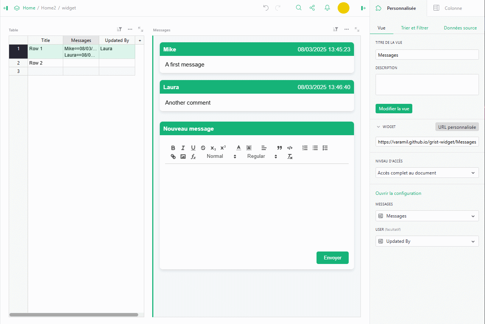
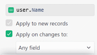

# Grist Message Widget
A widget to display a simple chat interface storing all messages in a row without additionnal table.

## Features
* Display messages in modern cards
* Rich text support (via [Quill](https://github.com/slab/quill)), including images, tables and formulas
* Include a form to post a new message
* Can display the sender name based Grist user name (*optional*)
* Everything is stored as html in row, no additional table required
* Localized (english, french and spanish)

## Installation
1. Choose or create a table for which you wish to add messages
2. Add a column to contain messages
3. *(Optional)* add a column and set the initialization formula to `user.Name`, check the box *Apply on changes to* then choose the column that will contain the messages (or more depending on your needs)

4. Add a new view of type *Custom* to your page by choosing as source the table that will contain your messages.
5. Select the *Custom URL* widget and paste the following URL into the field:  https://varamil.github.io/grist-widget/Messages/index.html then click on *Add a widget*
6. In widget configuration (right pane), authorize widget access to your table 
7. For *MESSAGES* option, select the column that will contain your messages
8. *(Optional)* select for the *USER* option the column containing the author of the changes. It looks necessary, when this last configuration has been done, to reload the page to ensure all configurations are applied properly
9. Adding a new message will update the row selected on linked widget

## Configuration
* *MESSAGES*: Select the column in the source table where to store the messages
* *USER*: *(optional)* you can select the column in the source table where to read the last sender. You need to use an auto update column with `user.Name` as init formula and *Apply on changes to* checked (optionnaly you can restrict it to the column used for messages). Clearly it's a trick because we cann't access user name with API, so when a new message is posted, the Message column is updated which trigger the User column, then this updated value is read back, and the Message column is finally updated with all information (author, date and content). Basically you can use *Updated By* shortcut ([doc](https://support.getgrist.com/authorship/#an-updated-by-column))

* *Open the configuration* : updates the widget to allow you to choose the theme used for the text editor: *Snow* formatting is done via a toolbar (like Word), *Bubble* formatting options appear when a portion of the text is selected (more compact display).

## Requirements
Grist table with at least one column containing data for the messages.
